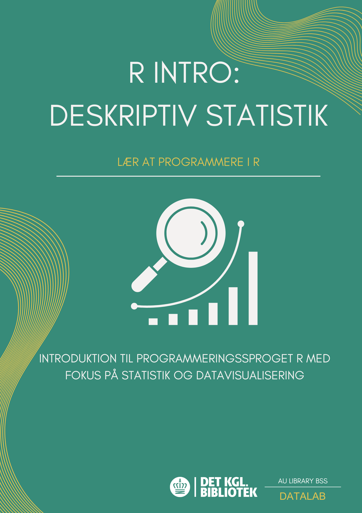

# R Intro - Deskriptiv Statistik
I denne workshop bliver du introduceret til programmeringssproget R samt den grafiske brugergrænseflade Rstudio, hvor vi skriver og kører vores kode. Workshoppen er målrettet nybegyndere, det vil sige at der ikke er forventninger til, at man har prøvet at programmere før. Hvis man har mulighed for det, må man meget gerne installere R og Rstudio på sin computer inden workshoppen eller oprette en profil på browserudgaven af Rstudio. Se vejledning nederst på denne side. 
  Workshoppen omhandler deskriptiv statistik og vi kommer blandt andet til at berøre:
1. Hvordan man navigerer i Rstudio
2. Hvordan man indlæser en Excel fil i R
3. Hvordan man anvender basale statistiske funktioner
4. Hvordan man laver visualiseringer

# Data
I mappen data findes det rådata vi bruger i workshoppen. Vores data stammer fra Erik Gahner Larsens bog 'Introduktion til R' (2022) og indeholder forskellige informationer omhandlende folketingsvalg i Danmark. Her ligger vores data i en excel fil fordelt på to ark/sheets. Det første af de to ark indeholder en tabel over antal stemmer fordelt på parti, og det næste ark indeholder en tabel over antal mandater fordelt på parti.

# Tilgå R og Rstudio
## Lokalt
### 1. Installer R
Download den nyeste version af R ned på din computer. Husk at vælg en version, der passer til din computers styresystem. R er et ’sprog’ vi skal bruge til at programmere med.
  R kan downloades her: https://posit.co/download/rstudio-desktop/
### 2. Installer RStudio
Download den nyeste version af RStudio ned på din computer. Husk at vælg en version, der passer til din computers styresystem. RStudio er selve applikationen, hvori vi skriver vores kode. Det er RStudio vi åbner, når vi skal programmere.
  RStudio kan downloades her: https://posit.co/download/rstudio-desktop/

## Via en browser
### Gå til Posit Cloud
Ønsker du at tilgå R og Rstudio fra en browser, skal du blot følge dette link: https://posit.cloud/plans/free. Her skal du enten oprette en gratis profil eller logge ind, hvis du allerede har en bruger.

# 
 

# Videre arbejde i R
Er du interesseret i at vide mere om R, så er disse bøger et oplagt sted at gå hen. Bøgerne kommer med en række øvelser, der kan klæde dig godt på i dit videre arbejde i R. 

R for Data Science (2e) fra 2023 af Hadley Wickham, Mine Çetinkaya-Rundel og Garrett Grolemund: https://r4ds.hadley.nz/ <b>
Introduktion til R fra 2022 af Erik Gahner Larsen <b>
Text Mining with R: A Tidy Approach fra 2024 af Julia Silge og David Robinson: https://www.tidytextmining.com/ 
